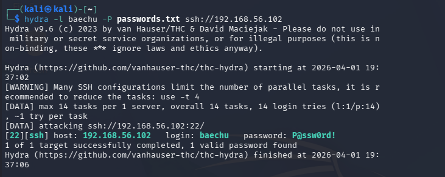
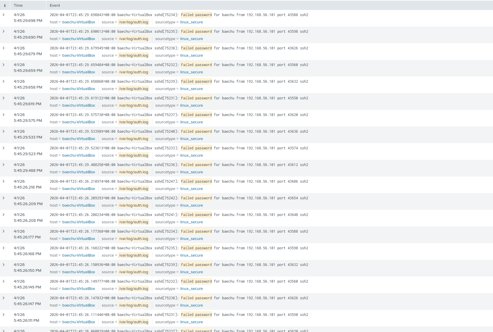
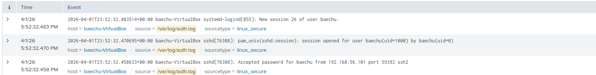

# 🔐 SSH Brute Force Detection Lab

---

## 📌 Overview

A brute force attack attempts to gain unauthorized access by systematically trying multiple password combinations against a target system. This technique is commonly observed in SSH services exposed to a network.

---

## 🧪 Lab Environment

- 🐉 **Attacker Machine:** Kali Linux  
- 🐧 **Target Machine:** Ubuntu Server  
- 📊 **Monitoring Tool:** Splunk Enterprise  

**Logs Monitored:**
- `/var/log/auth.log`  
- `/var/log/syslog`  

**Network Setup:**
- Host-only adapter (isolated lab environment)

---

## ⚔️ Attack Execution

From Kali Linux, a brute force attack was conducted using Hydra:

```bash
hydra -l <username> -P password.txt ssh://<target-ip>
```


## 🔎 Key Observations
High volume of failed login attempts
Repeated attempts from the same source IP
Successful authentication following multiple failures

### 🔐 Detect Failed Login Attempts
```spl
index=lab "Failed password"
| stats count by rhost, user
| where count > 5
```


### 🚨 Detect Successful Login After Failures
```spl
index=lab "Accepted password"
```


## 🧬 MITRE ATT&CK Mapping

- **T1110 – Brute Force**

---

## 🛡️ Mitigation & Defense

- Enforce account lockout policies  
- Enable Multi-Factor Authentication (MFA)  
- Restrict SSH access to trusted IP ranges  
- Deploy intrusion prevention tools (e.g., fail2ban)  
- Continuously monitor authentication logs  

---

## 💻 Post-Compromise Access

After obtaining valid credentials, SSH access to the target system was successfully established.
